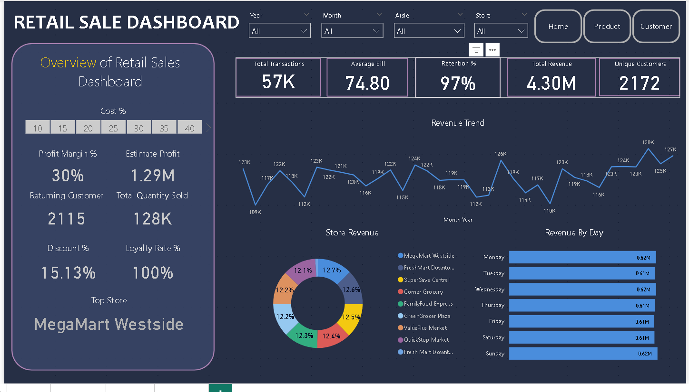
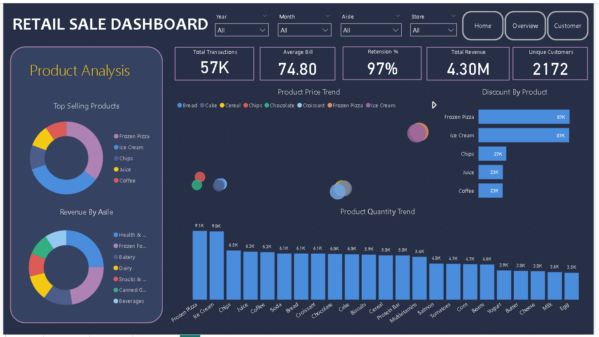
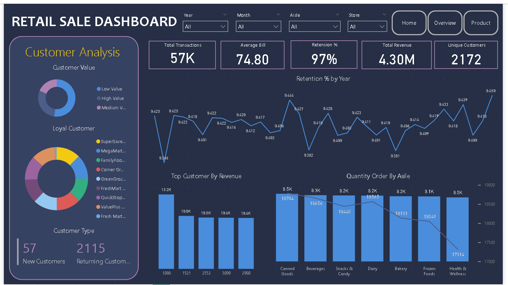

# Retail Sales Analytics Project

---

# Project Overview

This project demonstrates a complete **end-to-end Retail Sales Analytics workflow** using **Python, PostgreSQL, and Power BI**. The objective is to transform raw retail transaction data into structured, query-ready datasets and deliver business insights through interactive dashboards.

The project simulates a real-world retail environment and focuses on customer behavior, product performance, store comparison, and sales trends across multiple years.

---

# Dashboard Preview

## Home Dashboard



## Sales & Product Analysis



## Customer Analysis



---

# Objectives

* Clean and transform raw retail transaction data
* Store structured data in PostgreSQL database
* Perform SQL-based analytical transformations
* Build interactive Power BI dashboards
* Generate business insights related to customers, products, and stores
* Support data-driven retail decision making

---

# Tools & Technologies Used

## Programming

* Python
* Pandas
* NumPy

## Database

* PostgreSQL
* SQL (Joins, Aggregations, Window Functions, Views)

## Visualization

* Power BI
* DAX Measures
* Interactive Dashboard Design

---

# Dataset Information

* **Total Rows:** ~59,542 transactions
* **Time Period:** 2023 – 2025
* **Customers:** ~2,172
* **Stores:** 7
* **Product Categories:** Multiple aisles and products

## Main Columns

* customer_id
* store_name
* transaction_date
* aisle
* product_name
* quantity
* unit_price
* total_amount
* discount_amount
* final_amount
* loyalty_points
* year
* month
* day_name
* month_year

---

# Data Pipeline Architecture

```
Raw Retail Data (CSV)
            ↓
Python Data Cleaning & Feature Engineering
            ↓
retail_clean.csv
            ↓
PostgreSQL Database Storage
            ↓
SQL Views & Aggregations
            ↓
Power BI Dashboard
            ↓
Business Insights & Decision Support
```
---

# Key Business Insights

This project helps answer important business questions such as:

* Which customers generate the most revenue?
* Which products drive the highest sales?
* Which stores perform best?
* How loyal are customers over time?
* What percentage of customers drive 80% of revenue?

---

# Business Metrics Used

* **Total Revenue** → Sum of final_amount
* **Average Order Value (AOV)** → Revenue ÷ Transactions
* **Customer Lifetime Value (CLV)** → Total Spend per Customer
* **Retention Rate** → Returning Customers %
* **Pareto Contribution** → Top Customer Revenue %

---

# Performance Optimization

* SQL views used for pre-aggregation
* PostgreSQL used for scalable storage
* Optimized DAX measures used in Power BI
* Efficient indexing strategies applied in database

---

# How to Run This Project

## Step 1 — Run Python Cleaning Script

Clean raw data using Python:

```
python notebook.py
```

This generates:

```
retail_clean.csv
```

---

## Step 2 — Load Data into PostgreSQL

Use COPY command:

```sql
COPY retail_sales
FROM 'file_path/retail_clean.csv'
DELIMITER ','
CSV HEADER;
```

---

## Step 3 — Connect Power BI

* Connect Power BI to PostgreSQL database
* Load tables and SQL views
* Refresh dataset
* Explore dashboard insights

---

# Project Outcome

This project demonstrates a complete **Retail Business Intelligence pipeline** from raw data transformation to executive-level dashboard reporting.

The final solution supports **data-driven retail decisions** through structured analytics, scalable databases, and interactive business dashboards.

---

# Contact

If you found this project useful or have feedback, feel free to connect or share suggestions.
